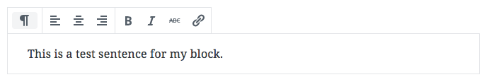
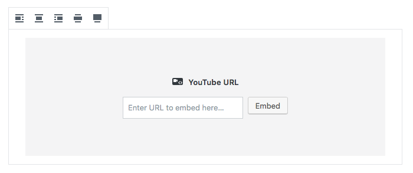

# Block Canvas

It's easy to forget, but the actual contents of your block, or the “canvas” (as we call it), is as much a place for controls as any other area of the UI.

Typically, the canvas area will primary be for entering text, but it's capable of much more. Ultimately, you can display any React component (and thus HTML content) inside the canvas, making it as flexible and powerful as the rest of the interface.

## Screenshots

_For the purposes of these screenshots, the blocks have been selected so the canvas boundary is clear._

**Text canvas:**

**Media Placeholder:**

## Do…

+ **…use placeholders when appropriate.** They provide a nicer experience when inserting a block that depends on additional action from a user (selecting a post, adding an embed URL, etc).

## Don't…

+ **…include controls that are *only* available in placeholders.** Placeholders should only be seen when a block is first inserted, so any action taken in a placeholder should be editable even after content has taken its place.