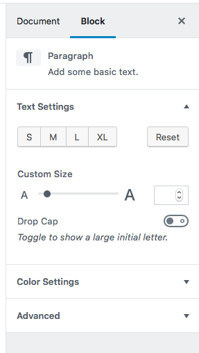

# Block Inspector

The Block Inspector is perhaps the most exciting part of the Gutenberg user interface for block implementors. It provides a consistently accessible panel to house settings for a block.

However, its great flexibility is also a tremendous liability. Because the inspector is so versatile, it can also quickly become overwhelming with options and settings.

## Screenshots

## Do…

+ **…set sensible defaults for any controls inside the block inspector.** Because it can be hidden, your users might not realise they have additional controls available.
+ **…group similar controls together.** Placing controls in logical groups improves discoverability.
+ **…prioritise commonly-used control groups.** Sorting control groups in order of most-to-least used (take an educated guess if you're not totally sure!) will simplify common tasks.

## Don't…

+ **…overload your users with controls.** It can be really tempting to offer users dozens of controls that allow fine-grained tweaking of every aspect of a block, but it can make for an overwhelming user interface and complicated code. Remember that one of [WordPress' philosophies is “decisions, not options”](https://wordpress.org/about/philosophy/) — try to embody that in your interface and make smart choices for your users.