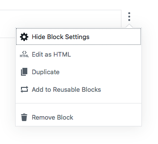

# Block Menu

The block menu is accessed through the ellipsis icon in a block's side controls. This menu contains controls that typically impact…

+ a block's relation to the document
+ the space around a block
+ and the block's relation to the site as a whole.

Controls in the block menu may also allow a user to manage state in the user interface and change the edit mode for a given block. However, it's important to reiterate that controls in the block menu should not, under most circumstances, alter a block's _own_ content.

## Screenshots

## Do…

+ **…think carefully before placing your own controls here.** Does your control _really_ alter the block's relation to the document, site, or editor interface?

## Don't…

+ **…place controls here if they alter a block's content.** Those controls are better suited for the toolbar or block inspector.
+ 

## Notes

+ Options in this menu should use Title Case.