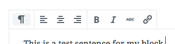
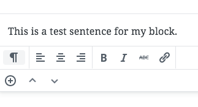

# Block Toolbar

The most familiar UI element for most WordPress users will be the block toolbar, which invokes the classic TinyMCE toolbar of the past (notably, the RichText component in Gutenberg is based on TinyMCE as well).

The toolbar can be a deceptively difficult design element, because it's easy to become a dumping ground for buttons and miscellaneous functionality. Designers should be conscious, in particular, of how their toolbars perform in narrow contexts, like mobile browsers or nested block areas, because toolbar buttons in Gutenberg don't currently wrap to multiple lines.

## Screenshots

**Desktop:**

**Mobile:**

## Do…

+ **…keep you toolbar buttons focussed on modifying the visual display of content.** Clicking a toolbar button generally (but not always!) leads to an immediately visible change in a block's appearance.

## Don't…

+ **…assume that a toolbar button from the Classic Editor should also exist in Gutenberg.** Because of the limited space for block controls, and the under-the-hood changes that encourage a rigid enforcement of your markup, it's sometimes more appropriate to create a custom block for your use-case.