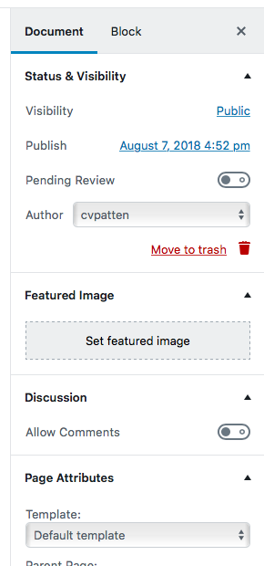

# Document Inspector

The typical interaction in Gutenberg is at the block level: managing block content, setting block attributes, etc.

Of course, blocks on their own are relatively meaningless. Their value comes from being arranged in a *document*, which has settings and attributes of its own. The **document inspector** provides a place to manage these options.

Typically, you won't need to extend the Document Inspector; blocks provide much of the functionality you'd need (even things like setting document-level meta fields can be handled more intuitively in blocks).

## Screenshots

## Do…

+

## Don't…

+