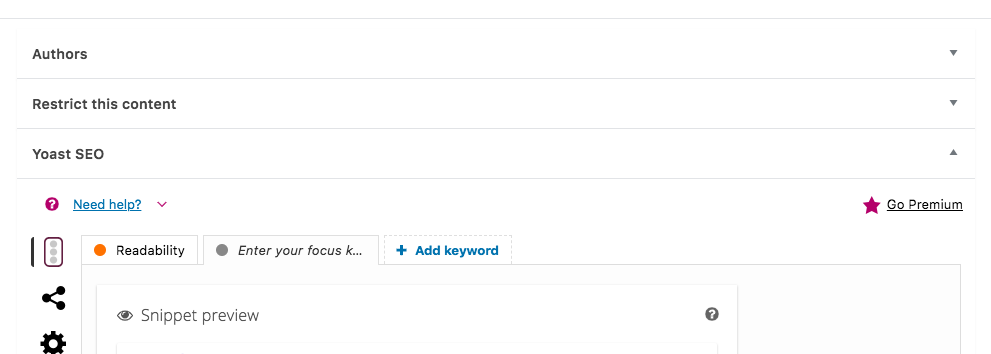

# Metaboxes

Metaboxes are a legacy approach of extending the WordPress editor UI. They are still accessible in Gutenberg, but have a number of downsides over standard Gutenberg UI integrations.

## Screenshots

## Don't…

+ **…use them.** Seriously, do everything you can to migrate away from metaboxes!